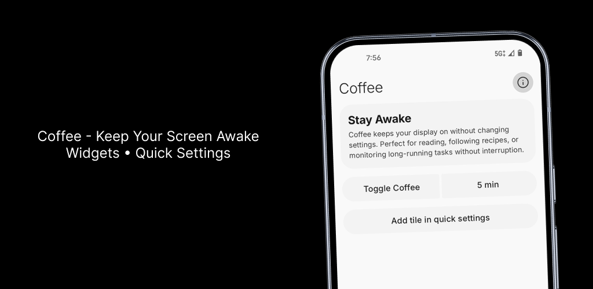
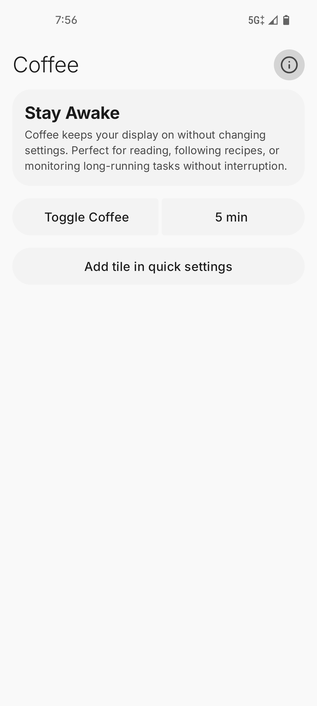
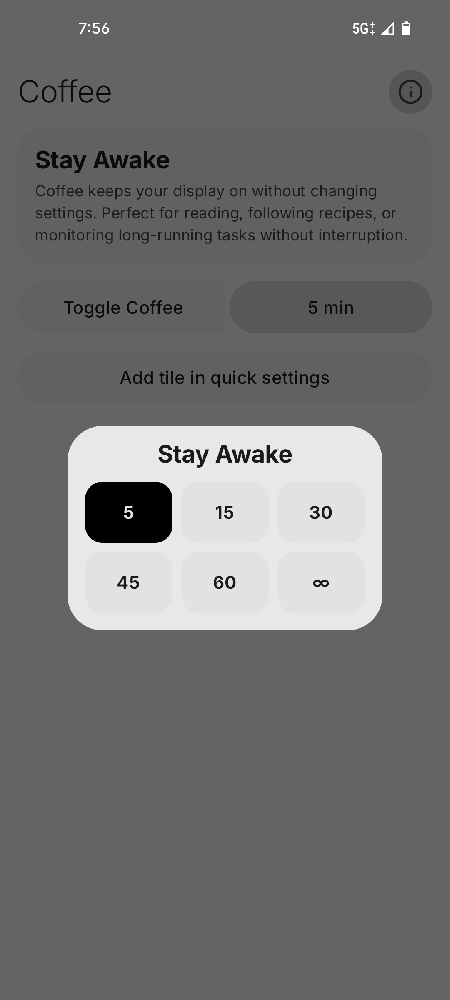
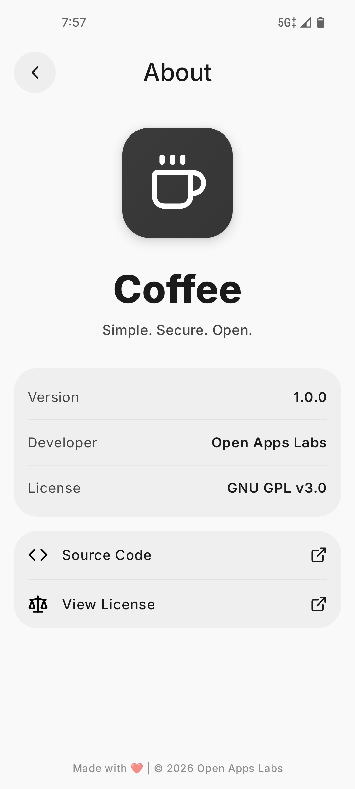
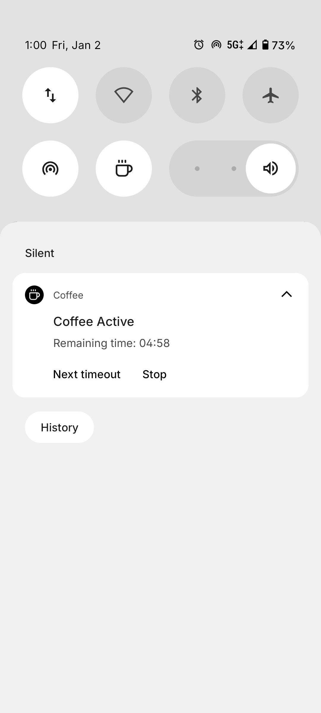

<h1 align="center">Coffee</h1>

    

  
  
  
  
  

**Keep Screen Awake**

Coffee is a modern, open-source Android utility built with Jetpack Compose and Material Design 3. It provides a Quick Settings tile to prevent screen dimming or locking during reading, navigation, or focused tasks, with customizable timers including indefinite mode.

> **Disclaimer:** Uses foreground service with WAKE_LOCK for reliable operation. Works on Android 10+. Test compatibility on your device.

---

## 📥 Download

Get the latest version of **Coffee**:

  
  
 
  
  

> ⚠️ This app is not available on the Google Play Store — use the links above to download the APK.

---

## 📱 Screenshots

  
  
   
  
  

---

## ✨ Features

* **Material You Design:** Fully compatible with Material 3 dynamic theming.  
* **Quick Settings Tile:** One-tap toggle with timer selection (1-60 min or infinite).  
* **Foreground Service:** Reliable screen-on with persistent notification.  
* **Lightweight:** Minimal footprint, instant response.  
* **No Ads/Trackers:** 100% privacy-focused, offline operation.

---

## 🤝 Contributing

Contributions are welcome!

- Fork the repo and create a branch  
- Keep changes small and focused  
- Test before submitting  
- Open a PR to `master`  

---

## 🐛 Bug Reporting

If you encounter any bugs, issues, or unexpected behavior while using Coffee, please feel free to [open an issue](https://github.com/OpenAppsLabs/Coffee/issues) on this repository.  

When reporting a bug, please include:

- Steps to reproduce the issue
- Device/Android version
- Screenshots (if applicable)

This helps me fix problems faster and improve the app for everyone. I welcome all constructive feedback and suggestions.

If you find Coffee useful, please consider ⭐ starring the repository to help others discover it.

---

## 📄 License

Coffee is licensed under the [GNU GPL v3.0](https://www.gnu.org/licenses/gpl-3.0.en.html).

---

## 🙏 Inspiration
Inspired by the OG [Coffee by @mueller-ma](https://github.com/mueller-ma/Coffee)
