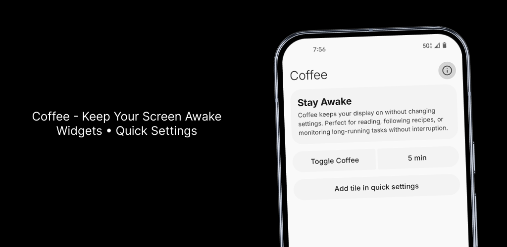
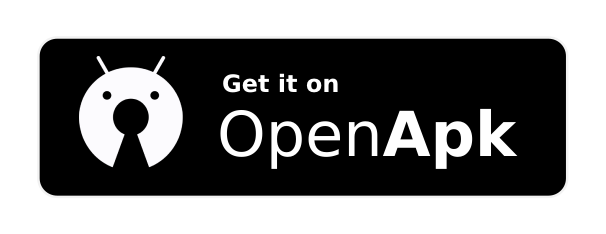
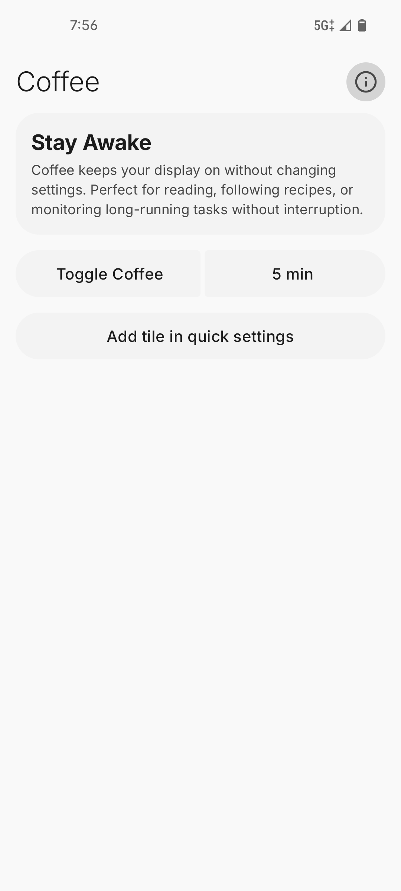
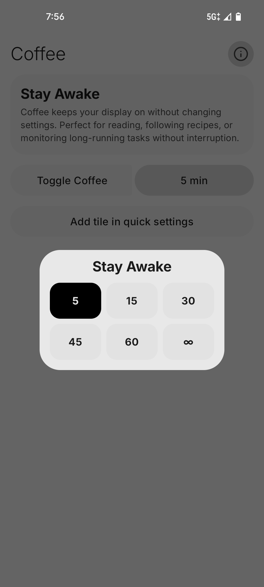
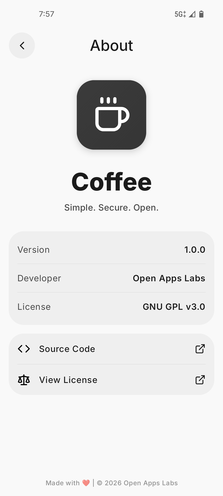
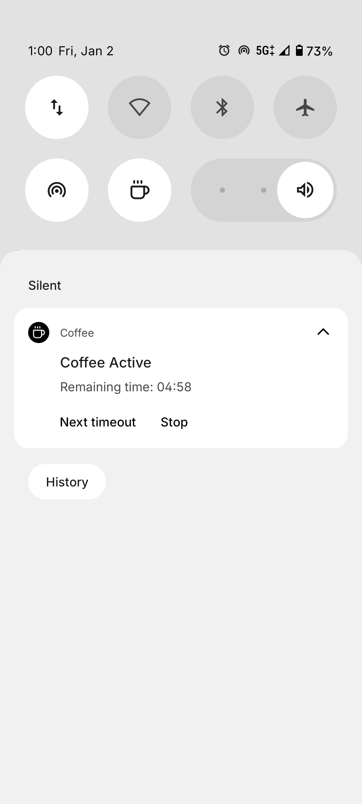

<h1 align="center">Coffee</h1>

    

  
  
  
  
  

**Keep Screen Awake**

Coffee keeps your screen awake whenever you need it.Use the Quick Settings tile to prevent dimming or locking during reading, navigation, or focused tasks.
Set a timer or keep it on indefinitely — simple, fast, and beautifully integrated with your system theme.

> **Disclaimer:** Uses foreground service with WAKE_LOCK for reliable operation. Works on Android 10+. Test compatibility on your device.

---

## 📥 Download

Get the latest version of **Coffee**:

  
  
 
  
  

> ⚠️ Coffee is currently not available on the Google Play Store. Please use the links above to download.

---

## 📱 Screenshots

  
  
   
  
  

---

## ✨ Features

* **Material You Design:** Beautiful dynamic colors that match your system theme.
* **No Ads or Trackers:** 100% private and fully offline.
* **Home Screen Widgets:** Customizable widgets with 20+ expressive shapes, multiple styles, and smooth animations.
* **Quick Settings Tile:** One-tap toggle with timer options (1–60 min or infinite).
* **Persistent Notification:** Keeps your screen on reliably while the timer is active.
* **Extend Session:** Add more time without restarting.
* **Lightweight:** Fast, simple, and minimal.

---

## 🐛 Bug Reporting

If you encounter any bugs, issues, or unexpected behavior while using Coffee, please feel free to [open an issue](https://github.com/OpenAppsLabs/Coffee/issues) on this repository.  

When reporting a bug, please include:

- Steps to reproduce the issue
- Device/Android version
- Screenshots

This helps me fix problems faster and improve the app for everyone.

If you find Coffee useful, please consider ⭐ starring the repository to help others discover it.

---

## 📄 License

Coffee is licensed under the [GNU GPL v3.0](https://www.gnu.org/licenses/gpl-3.0.en.html).
